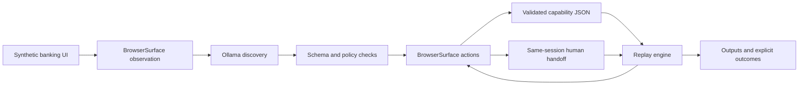

# Learn Once, Replay

**Discover a browser workflow with an LLM. Save a typed capability. Replay it without model calls.**

Learn Once, Replay is a TypeScript prototype for reusable UI automation. Its synthetic banking demo finds a member, opens a savings account inside an iframe, and returns the displayed balance. Discovery uses local Ollama by default; execution uses Playwright and a strict Zod contract.

The engineering focus is the boundary between model decisions and execution: parameterized inputs, validated actions, declared outputs, bounded recovery, business outcomes, and human takeover of the same browser session.

**Status:** demonstrable prototype for one read-only web workflow. Arbitrary workflow reliability, desktop automation, production banking integrations and tenant catalogs are not implemented.

## Architecture



Discovery selects named controls from a compact accessibility snapshot and records successful actions. A capability is saved only after an output has been captured and the model's proposed checkpoint matches the live page. Replay validates the artifact and inputs, executes the declared steps, and verifies the final checkpoint. **The replay path never calls a model.**

| Module | Responsibility |
|---|---|
| [`src/discovery.ts`](src/discovery.ts) | Structured model decisions, bounded requests and capability recording |
| [`src/schema.ts`](src/schema.ts) | Strict capability, locator, action, input/output and recovery contracts |
| [`src/replay.ts`](src/replay.ts) | Ordered execution, business outcomes, recovery and final verification |
| [`src/surface.ts`](src/surface.ts) | Browser interaction, observation, evidence and session ownership |
| [`src/policy.ts`](src/policy.ts) | Allowed destinations/actions and demonstration redaction |
| [`src/demo.ts`](src/demo.ts) | Local synthetic target with reproducible exceptional states |
| [`src/cli.ts`](src/cli.ts) | Demo, discovery and replay commands |

See [`REPORT.md`](REPORT.md) for the full design and trade-offs.

## Run the saved capability

Requirements: Node.js 22 or newer, npm, and Playwright Chromium. Ollama is needed only to discover a new capability.

```sh
git clone https://github.com/OmElMon/learn-once-replay.git
cd learn-once-replay
npm ci
npx playwright install chromium
npm run demo
```

Leave the demo running. In another terminal:

```sh
npm run replay -- \
  --artifact evidence/discovery/capability.json \
  --inputs '{"member_id":"67890"}' \
  --out runs/replay
```

The result should return `status: "success"` and `savings_balance_amount: "$8,420.50"`. This is fake demo data. Replay needs no API key, model download or paid service.

## Discover a new capability locally

Install and start [Ollama](https://ollama.com), then download the default model:

```sh
ollama pull qwen2.5:3b
```

With the demo still running:

```sh
npm run discover -- \
  --goal 'Look up the supplied member and read their current savings balance.' \
  --inputs '{"member_id":"12345"}' \
  --out runs/discovery \
  --headed

npm run replay -- \
  --artifact runs/discovery/capability.json \
  --inputs '{"member_id":"67890"}' \
  --out runs/new-replay
```

The capability contains declared inputs/outputs, input placeholders, locators, recovery rules and a checkpoint. It contains no executable scripts, model conversation or captured balance. Locators use accessible roles, labels or exact text, with an optional logical frame identity.

The local discovery path handles one output per run. It permits at most 10 model calls, with up to 1,000 output tokens and a 120-second timeout per call. `--max-steps` can lower that call budget. `OLLAMA_MODEL` selects another installed model.

## Outcomes, recovery and takeover

| Result | Meaning |
|---|---|
| `success` | Declared outputs were read and the checkpoint matched |
| `business_outcome` | Valid domain outcome such as a missing member, or invalid input |
| `failed` | Permission denial, exhausted recovery, missing output or execution/checkpoint failure |
| `intervention_required` | Human takeover was aborted or expired |

The CLI exits nonzero for `failed` and unresolved `intervention_required` results. Known transient errors have bounded recovery; unexpected state does not trigger speculative alternative clicks.

```sh
# Missing member: business outcome.
npm run replay -- --artifact evidence/discovery/capability.json \
  --inputs '{"member_id":"99999"}' --out runs/not-found

# Known interruption: declared Retry recovery.
npm run replay -- --artifact evidence/discovery/capability.json \
  --url 'http://127.0.0.1:3100/?scenario=transient' --out runs/transient

# Permission denial: hard failure with diagnostic state.
npm run replay -- --artifact evidence/discovery/capability.json \
  --url 'http://127.0.0.1:3100/?scenario=denied' --out runs/denied

# Same-session human takeover.
npm run replay -- --artifact evidence/discovery/capability.json \
  --url 'http://127.0.0.1:3100/?scenario=handoff' --out runs/handoff --headed
```

For takeover, wait for the yellow banner. Click **Verify session** inside the banking page, then **Resume automation** in the banner within two minutes. **Abort run** is also available. Automation pauses while the operator owns the session, records manual click/change events without field values, and resumes from the pending step. Headless runs cannot accept manual input and return an unresolved intervention for this scenario.

## Tests and evidence

```sh
npm run check
npm test
```

The tests cover strict schema rejection, destination/action policy, redaction, parameter reuse, business outcomes, recovery, ownership transfer, checkpoints, scripted discovery integration and invalid provider responses. They use local browsers and scripted model responses, with no paid API calls.

To verify the saved model-generated artifact across five scenarios, leave the demo running:

```sh
node --import tsx tests/verify-generated.ts
```

[`evidence/README.md`](evidence/README.md) distinguishes three evidence sources:

- **Genuine local discovery:** a saved Qwen2.5 3B run used six model calls to generate four steps. Repository-provided verification binds subsequent replay scenarios to that artifact by SHA-256.
- **Offline demonstration:** `npm run evidence` starts its own server and uses a clearly labeled hand-authored fixture. Scripted tests and simulated operators verify integration, rather than discovery reliability or human participation.
- **Development history:** nine unsuccessful discovery attempts are preserved; a separate real-person headed handoff is documented. One saved success does not establish a repeatable discovery success rate.

Repeated commands in the same output directory append to `events.jsonl`; use fresh directories when comparing runs.

## Limits and data handling

This implementation intentionally uses synthetic data. Policy restricts destinations and actions; logs redact supplied inputs, selected credential patterns, known synthetic names and amounts. Failures capture redacted accessibility state. These controls are tailored to the demo and are not comprehensive production authorization or privacy controls.

Declared outputs are returned to the caller. Avoid redirecting sensitive output into logs. Desktop execution, tenant catalogs, capability signing, distributed scheduling, production DLP and authenticated co-browsing remain design proposals, not implemented features. Deterministic replay means fixed actions and bounded policy branches, not identical timing or unchanged external data.

## Optional hosted discovery

The default provider is local Ollama. The optional OpenAI adapter requires explicitly setting `LLM_PROVIDER=openai`, `OPENAI_API_KEY` and `OPENAI_MODEL` in the shell. It uses separately billed API access and a 45-second request timeout. The application does not load `.env` files. Never commit credentials.
